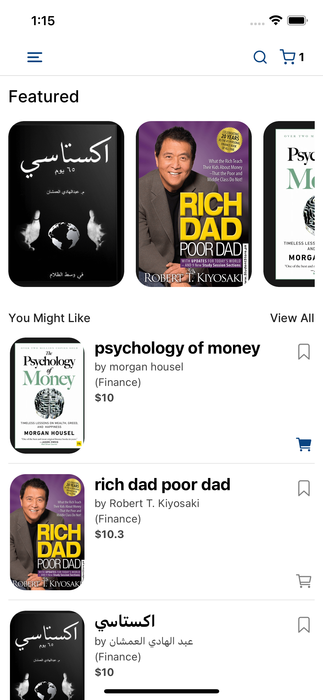
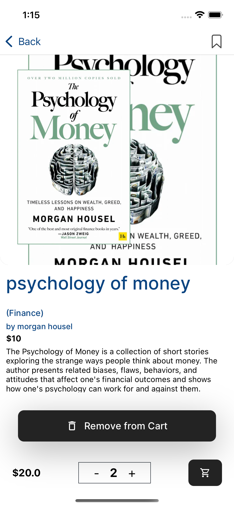
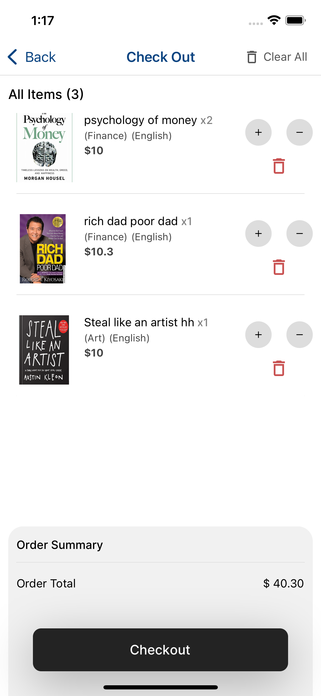
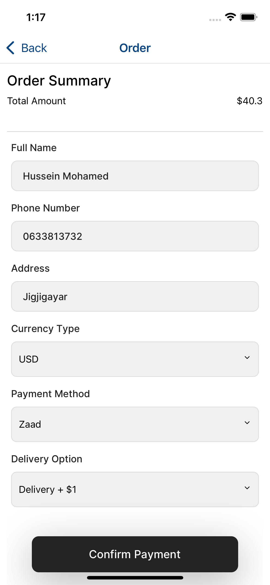

# Bookstore Mobile App

Welcome to the Bookstore Mobile App!

## Introduction

The Bookstore Mobile App is your one-stop destination for discovering, purchasing, and managing your favorite books. Built with React Native Expo and the latest Expo router, our app offers a seamless browsing and shopping experience for book enthusiasts. Leveraging TypeScript and Zustand, we ensure efficient state management and data persistence, allowing users to seamlessly bookmark books, add them to the cart, and enjoy a hassle-free checkout process.

## Features

- **Browse and Discover**: Explore a vast collection of books, categorized for easy navigation and discovery.
- **Purchase Books**: Seamlessly purchase books using integrated local payment methods, ensuring a secure and convenient transaction process.
- **Bookmark Books**: Keep track of your favorite books by bookmarking them for future reference.
- **Add to Cart**: Build your reading list by adding books to the cart for easy checkout.
- **Efficient State Management**: Utilizing Zustand, our app ensures efficient state management, providing a smooth and responsive user experience.
- **Data Persistence**: TypeScript and Zustand work together to persist user data locally, ensuring a seamless browsing experience even when offline.

## Screenshots

    
    
    
    

## Getting Started

To get started with our Bookstore Mobile App, follow these steps:

1. **Installation**: Download the app from the App Store or Google Play Store.
2. **Sign Up or Log In**: Create an account or log in to access the full range of features.
3. **Browse and Discover**: Explore the vast collection of books and start adding your favorites to the cart.
4. **Purchase and Enjoy**: Complete your purchase and enjoy your new reads!

## Future Availability

Our Bookstore Mobile App will soon be available on the App Store for iOS devices and on the Google Play Store for Android devices. Stay tuned for updates on the official release!

## Future Enhancements

We are committed to continuously improving our Bookstore Mobile App. Some future enhancements we are considering include:

- Integration with additional payment gateways for enhanced flexibility.
- Personalized recommendations based on user preferences and browsing history.
- Social sharing features to allow users to share their favorite books with friends and followers.

## Feedback and Support

We value your feedback and are dedicated to providing exceptional support to our users. If you encounter any issues or have suggestions for improvement, please don't hesitate to reach out to our support team.

Thank you for choosing our Bookstore Mobile App. Happy reading!

---
